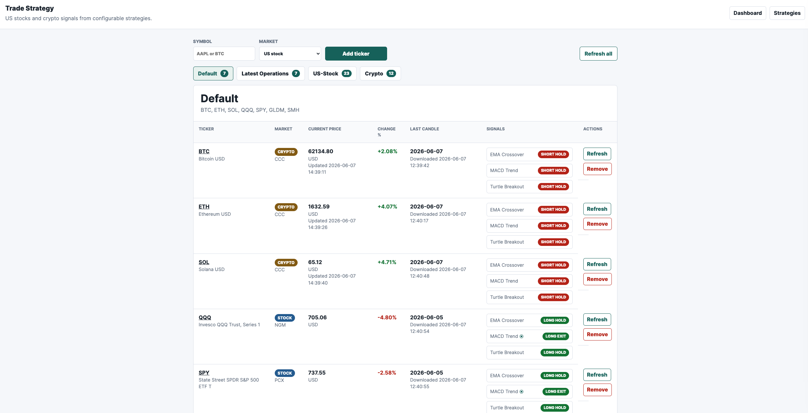

# Trade Strategy

A local Flask app for tracking US stocks and crypto coins, storing market data
in SQLite, and viewing configurable strategy signals, operation history, charts,
and yearly backtests.



## Features

- Track US stocks and crypto tickers.
- Store tickers, daily candles, current prices, strategy settings, cached
  operations, and notification dedupe data in embedded SQLite.
- Add, remove, refresh one ticker, or refresh all tickers from the dashboard.
- Backfill daily data from `2000-01-01` when adding or force-refreshing tickers.
- Fill missing/stale history on server startup.
- Configure the daily history fetch time from the Strategies page. The default
  is `00:01` UTC.
- Optionally enable realtime price updates with configurable polling frequency.
- Batch-fetch realtime prices where supported, then update each ticker's current
  price and provisional current-day candle.
- Use in-memory realtime trigger snapshots to avoid slow 5-day daily-history
  fetches unless a strategy operation is likely to be triggered.
- Respect US stock market trading days and regular US market hours for stock
  realtime updates.
- Send Telegram notifications when realtime data triggers a new operation.
- Display dashboard groups: Default, Latest Operations, US-Stock, and Crypto.
- Open ticker links in Yahoo Finance charts.
- Open signal/operation pages in a new tab.
- Display operation charts, operation history, and yearly strategy-vs-buy-hold
  backtests.

## Strategies

### EMA Crossover

Compares a fast EMA and slow EMA.

Default parameters:

- Fast EMA window: `12`
- Slow EMA window: `26`

Signals:

- Fast EMA above slow EMA: long direction
- Fast EMA below slow EMA: short direction
- Direction changes create exit and entry operations

### MACD Trend Tracking

Uses MACD signal-line crosses with an optional trend EMA filter.

Default parameters:

- Fast EMA window: `12`
- Slow EMA window: `26`
- Signal EMA window: `9`
- Trend EMA filter: enabled
- Trend EMA window: `200`

Signals:

- MACD crosses above signal line and trend filter allows it: long entry
- MACD crosses below signal line and trend filter allows it: short entry
- MACD/trend no longer supports the active direction: exit

### Turtle Breakout

Uses Donchian-style breakout and exit levels with dual-direction trading.

Default parameters:

- Entry breakout window: `20`
- Exit breakout window: `10`
- ATR window: `20`
- Exit ATR ratio: `2.0`
- Moving Average filter: disabled by default
- MA filter window: `200`
- Maximum position units: `4`

Notes:

- Entry levels use prior-day channel values.
- Stop loss uses the last signal price plus or minus `Exit ATR ratio * ATR`.
- ATR is fixed from the entry day during one operation cycle.
- Add-position levels use `0.5 ATR` intervals.
- Each Turtle unit is capped so a full `4` unit position does not exceed the
  strategy balance allocation.

## Position Sizing

Each strategy starts with a virtual `$10,000` balance. Operation history includes:

- Signal price
- Operation price
- Position size
- Position notional
- Realized P/L
- Balance after operation

Position sizing uses volatility-aware risk where strategy metrics provide the
needed volatility context, while still respecting per-unit notional caps.

## Pages

- Dashboard: grouped tickers, current prices, latest candles, and strategy
  signals.
- Strategies: common settings and per-strategy parameters.
- Operations: operation chart, metrics, and full operation history for a ticker
  and strategy.
- Back Test: yearly strategy performance compared with buy and hold.

## Common Settings

The Common section on the Strategies page includes:

- Default group tickers
- Realtime trading data update
- Realtime update frequency, default `300` seconds
- Daily data fetch time, default `00:01` UTC
- Send Notification to Telegram
- Telegram bot token
- Telegram chat ID

The Telegram bot token is intentionally not rendered back into the HTML. When a
token is saved, the field displays `******`; leaving it unchanged preserves the
saved token.

## Setup

```bash
python3 -m venv .venv
source .venv/bin/activate
pip install -r requirements.txt
pip install -e .
```

## Run Locally

```bash
flask --app trade_strategy.app run --debug
```

Open:

```text
http://127.0.0.1:5000
```

The default SQLite database is:

```text
data/trade_strategy.sqlite3
```

Use a different database path:

```bash
TRADE_STRATEGY_DB=/path/to/trade_strategy.sqlite3 flask --app trade_strategy.app run
```

Disable automatic startup/daily/realtime background refreshers:

```bash
TRADE_STRATEGY_AUTO_REFRESH=0 flask --app trade_strategy.app run
```

## Docker

Build:

```bash
docker build -t trade-strategy:latest .
```

Run with persistent SQLite data:

```bash
docker run -d \
  --name trade-strategy-app \
  -p 5001:5001 \
  -v "$PWD/data:/app/data" \
  trade-strategy:latest
```

Open:

```text
http://127.0.0.1:5001
```

Replace a running container after rebuilding:

```bash
docker rm -f trade-strategy-app
docker run -d \
  --name trade-strategy-app \
  -p 5001:5001 \
  -v "$PWD/data:/app/data" \
  trade-strategy:latest
```

View logs:

```bash
docker logs --tail 120 trade-strategy-app
```

## Telegram Notifications

1. Create a Telegram bot with BotFather.
2. Start a conversation with the bot or add it to a group.
3. Get the target chat ID.
4. Open the Strategies page.
5. Enable `Send Notification to Telegram`.
6. Enter the bot token and chat ID.
7. Save settings.

Notifications are sent when realtime data creates a new latest operation and the
operation has not already been notified.

## Tests

```bash
PYTHONPATH=src pytest -q
```

Compile check:

```bash
PYTHONPATH=src python -m compileall src tests
```

## Data Notes

- Market data is downloaded with `yfinance`.
- Current prices are stored separately from daily history.
- Realtime prices create/update a provisional current-day candle so strategy
  snapshots can react before the daily authoritative fetch runs.
- The scheduled daily fetch reconciles saved candles with provider data.
- US stock realtime updates are skipped outside the regular US market session.

## Project Layout

```text
src/trade_strategy/
  app.py                Flask routes and page assembly
  database.py           SQLite schema and persistence helpers
  market_data.py        yfinance download and realtime price helpers
  market_calendar.py    US market calendar and UTC scheduling helpers
  strategies.py         Strategy interfaces and implementations
  operation_manager.py  Cached operations and realtime trigger snapshots
  refresher.py          Startup, daily, and realtime background refreshers
  notifications.py      Telegram notification sender
  charting.py           Operation chart data builder
  templates/            Jinja templates
  static/               CSS
tests/                  Pytest coverage
```
